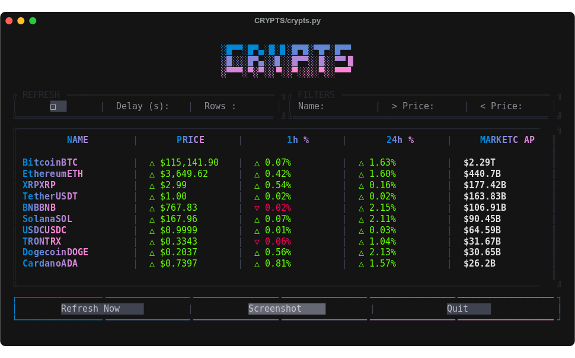

# CRYPTS

A simple **Terminal User Interface (TUI)** built with [PyTermGUI](https://github.com/bczsalba/pytermgui) to display cryptocurrency market data from [CoinMarketCap](https://coinmarketcap.com/).



## ✨ Features

- Fetches **live cryptocurrency prices** from CoinMarketCap  
- Configurable **row limit** for display  
- **Name & price filters** (WIP)  
- **Color-coded** price indicators with up ▲ / down ▼ carets  
- **Screenshot capture** (saves as SVG)  
- **Quit confirmation modal**  


## 📦 Installation

```bash
git clone https://github.com/hosnizaaraoui/CRYPTS
cd CRYPTS
pip install -r requirements.txt
